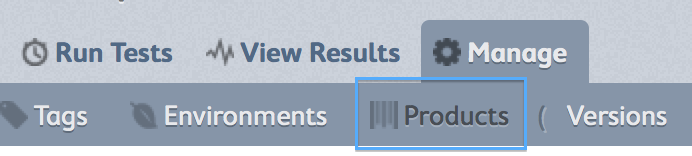
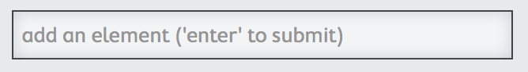

.. _getting-started:

Getting Started Guide
=====================

If you're new to MozTrap and would like a general walk-though of how to get
initial data setup and start testing your product, this is your guide.

Setup a new product in a new system
-----------------------------------

The following is a description of how to setup your new system to test your
product.

Create the environments
^^^^^^^^^^^^^^^^^^^^^^^

Odds are you will be testing your product in several
:ref:`environments<environments>`.  These could be a collection of hardware
devices, web browsers, operating systems, or even spoken languages.
You want to be sure to have appropriate coverage so that
you can ensure quality in the environments your product will be used.

For this we have :ref:`Environment Profiles <environment-profiles>`.

It's a good idea to familiarize yourself with the pieces that make up
an environment, so consider reading :ref:`environments<environments>`
before continuing.

To create a new environment profile customized to your needs, follow these
steps:

    #. navigate to ``manage | environments``
        * |manage_environments|
    #. click ``create a profile``
    #. give your profile a name
    #. Depending on your setup, you may have several
       :ref:`environment elements<environment-elements>` in your system already.
    #. If you see a category that applies to your product already, then expand
       It to choose the elements that apply.  If not, then click |add_category|
       to create a new one
    #. Within a category, if you don't see the correct element, then create
       one by typing in the field |add_element| and hitting enter
    #. Once you have all the categories and elements checked that you want to
       test, click ``save profile``

This will create a matrix list of all possible combinations of the environment
elements you chose.  However, it may be true that you don't want to test ALL
combinations.  If that's the case, then you can winnow down the list to test.

To winnow down the list of environments to test:

    #. click the edit |edit_icon| icon next to your environment profile.
    #. exclude any environment by clicking the **X** next to it.
    #. click ``done editing``

Create your Product
^^^^^^^^^^^^^^^^^^^

For this example, we will presume your product is called **SpeckDetector**.
It detects specks.  Very handy.

    #. navigate to ``manage | products``:
        * |manage_products|
    #. click ``create a product``
    #. fill out the name and description
    #. set version to 1.0.  see :ref:`Product Versions <product-versions>`
       for more info on how version naming works.
    #. set the environment to the environment profile you created earlier.  Or
       you can optionally leave it blank and add them later.
    #. click save
    #. you now have a product and version!

.. |manage_environments| image:: img/manage_environments.png
    :height: 50px

.. |add_category| image:: img/add_category.png
    :height: 20px

.. |edit_icon| image:: img/edit_icon.png
    :height: 20px

Create some tests in an existing system
---------------------------------------

In progress...

Run some tests in an existing system
------------------------------------

In progress...