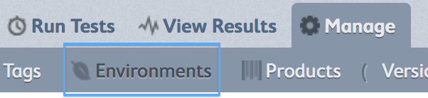
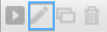

.. _tutorial-create-product:

MozTrap Tutorial, part 1
========================

The following is a description of how to setup your new system to test your
product.  Part 1 will focus on setting up your Product and Environments.

Setup Environments
------------------

Odds are you will be testing your product in several
:ref:`environments<environments>`.  These could be a collection of hardware
devices, web browsers, operating systems, or even spoken languages.
You want to be sure to have appropriate coverage so that
you can ensure quality in the environments your product will be used.

For this we have :ref:`Environment Profiles <environment-profiles>`.

It's a good idea to familiarize yourself with the pieces that make up
an environment, so consider reading :ref:`environments<environments>`
before continuing.

To create a new environment profile customized to your needs, follow these
steps:

    #. Navigate to ``manage | environments``:
        * |manage_environments|
    #. Click ``create a profile``.
    #. Give your profile the name ``Speck Envs``.
    #. .. note::

           Depending on your setup, you may have several
           :ref:`environment elements<environment-elements>` in your system already.

           If you see a category that applies to your product already, then expand
           It to choose the elements that apply.  If not, then click |add_category|
           to create a new one.
    #. In our case, we'll need to create everything, so click |add_category|
       and type ``location`` and hit enter.
    #. In the category, find the field that says |add_element| and type
       ``laboratory`` and hit "enter".
    #. Add another element called ``field`` and hit enter.
    #. Make sure to select the ``location`` category checkbox and all its elements.
    #. Click ``save profile``.

.. note::

    This will create a matrix list of all possible combinations of the
    environment elements for each category you chose.  In our case it's very
    simple (only 2).  However, for other products, you may have several
    categories.  It may be true that you don't want to test ALL combinations
    that were created.  If that's the case, then you can winnow down the list
    to test.

To winnow down the list of environments to test:

    #. Click the edit |edit_icon| icon next to your environment profile.
    #. Exclude any environment by clicking the **X** next to it.
    #. Click ``done editing``.

Create a Product
----------------

Now that you have your environment profile setup, let's create your product.
We will presume your product is called **SpeckDetector**.
It detects specks.  Very handy.

    #. Navigate to ``manage | products``:
        * |manage_products|
    #. Click ``create a product``.
    #. Fill out the name and description.
    #. Set version to 1.0.  see :ref:`Product Versions <product-versions>`
       for more info on how version naming works.
    #. Set the environment to the environment profile you created earlier.  Or
       you can optionally leave it blank and add them later.
    #. Click save.
    #. You now have a product and version!

.. |manage_products| image:: img/manage_products.png
    :height: 50px

.. |add_element| image:: img/add_element.png
    :height: 40px

