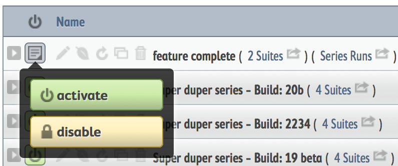

.. _tutorial-create-runs:

Moztrap Tutorial, part 3
========================

In this section, we use the pieces you've already built to create and activate
a test run that users can execute.

Create a Test Run
-----------------

Test Runs are made up of test suites and are specific to a version of your
product.  You may want to have several test runs.  One could be called
``smoke`` and another ``feature complete`` and yet another
``full functional tests``.  Or you could break them up into larger functional
areas like ``front-end`` and ``server``.

Let's create your first **SpeckDetector** test run.  It will contain all the
suites you have created so far.  Let's call this ``feature complete``.

Steps
^^^^^
    #. Navigate to ``manage | runs``.
    #. Click ``create a test run``.
    #. Set your product version to ``SpeckDetector 1.0``.
    #. Set name to ``feature complete``.
    #. Enter a description that includes Markdown_ syntax.  This information
       will be displayed at the top of each page while running the tests::

        LINKS
        =====
        * [Specks of Life](http://example.com/)
        * [Bugzilla](http://bugzilla.mycompany.com)

    #. :ref:`series<test-run-series>` defaults to true.  We will want to run
       our tests against several ongoing builds of the **SpeckDetector**, so
       in our case we *will* create a series.  Please take a moment to see
       what a :ref:`run series<test-run-series>` is.
    #. Leave the ``start`` date as today.  If you want the run to expire, then
       set the ``end`` date, too.
    #. Drag both suites from ``available`` to ``included``.
    #. Click ``save run``.

Activate your Run
-----------------

Your run is just about ready.  However, there's one more critical step you
must take before it can be executed.  You must make the run *active*.

Why not have test runs active all the time?  Good question.
:ref:`Look here<test-run-states>`, Curious George.

Steps
^^^^^
    #. Navigate to ``manage | runs``.
    #. Find your test run ``feature complete``.
    #. Click the status icon.
        * |run_activate|
    #. Click "Activate".

Isn't this exciting?  You now have a test run series created and ready to go!
Go tell your boss.

.. _Markdown: http://daringfireball.net/projects/markdown/syntax

