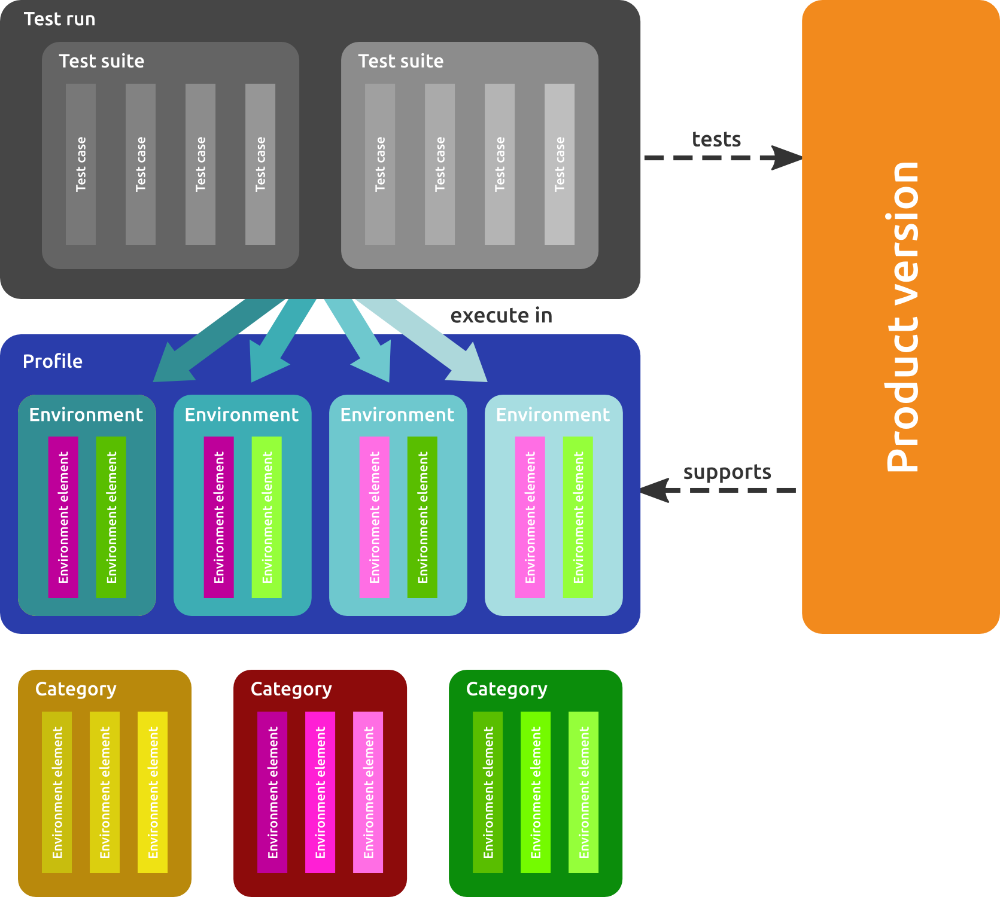

.. image:: ../../img/126x126.png

.. _tutorial:

MozTrap Tutorial
================

This tutorial assumes that your instance of MozTrap has been fully installed
and that you are a user with the role of :ref:`Admin<admin-role>`.

.. note::
    This tutorial is a work in progress and is, as yet, incomplete.

Contents
--------

.. toctree::
    :maxdepth: 2

    create_product
    create_cases
    create_runs
    start_testing
    view_results
    new_version

Concepts overview
-----------------

This is a rough sketch of the concepts in MozTrap to provide an overview of how
the elements described in the tutorial are related to each other.

Everything revolves around the *product* under test in a specific *version*.

*Test runs* on the product version are executed by assigned testers. The test
instructions are contained in *test cases* which are grouped in *test suites*
for assignment to the runs.

The tests are run in defined *environments* whereupon the *environment profile*
specifies the environments supported by the product version.

The environments themselves are composed of *environment elements* chosen from
*categories*, one element per category.

Indices and tables
==================

* :ref:`genindex`
* :ref:`modindex`
* :ref:`search`
