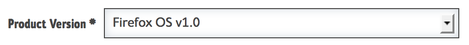

.. _tutorial-new-version:

Moztrap Tutorial, part 6
========================

.. _new-product-version:

Create New Version
------------------

Now let's say that you shipped version 1.0 and are ready to start testing
version 2.0 of the **SpeckDetector**.

Steps
^^^^^

    #. Navigate to ``Manage | Versions``.
    #. Click the "create a version" button.
    #. Set the product to the ``SpeckDetector``.
    #. Specify the version to copy Environments and Cases from.  In our case,
       this will be ``1.0``.
    #. Type in the name of the new Version.  In our case: ``2.0``.
    #. Codename is optional.
    #. Click the "save productversion" button.

Result
^^^^^^
Now you will have a new product version, and a new ``2.0`` version of each test
case.  If you change the ``2.0`` version of a case, the ``1.0`` version remains
unchanged.  This is so that the steps in your test can evolve as your product
does without changing the tests that applied to earlier versions.

.. _migrate_runs:

Migrate Runs
------------

Test runs are specific to a version of your product.  But you can easily
make copies of runs from one to the other.

Steps
^^^^^
    #. Navigate to ``Manage | Runs``.
    #. Find the test run you want to use in 2.0.
    #. Click the clone button for that run.
    #. The new run will have the name "Cloned: foo" and be in DRAFT mode.
    #. Edit the newly cloned run.  **Note:** It must be in DRAFT mode to change
       the product version field.
    #. Update the name as you wish.
    #. Change the Product Version field to the new version 2.0:
        * |product_version|
    #. Save as status active, or...
    #. Activate the new run with the status drop-down.

Result
^^^^^^
Now you will have a new run that applies to your new product version ``2.0``
that is ready to be executed.

