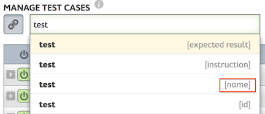
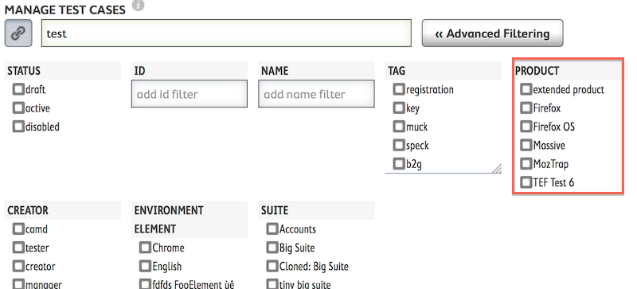

Filtering
=========

.. _filtering:

Quick Filtering
---------------

.. _quick-filters:

.. image:: img/filter_quick.png

You can type into this field if you generally know the text of what you want
to filter on.  Auto-complete will give you several choices.  Take care to
select the choice with the correct ``field``.  For instance

Here you can see that filtering can be done on any of these specific fields.
If you filter for the word ``test`` in the wrong field, you may not get the
results you were hoping for.

Advanced Filtering
------------------

.. _advanced-filters:

.. image:: img/filter_advanced.png

Clicking the Advanced Filtering button will expand a list of supported filter
fields for the current screen.

This can help be more specific in your filtering and can also help if, for
instance, you don't know the exact spelling of the ``product`` you would like
to filter on.

Sharing Filters
---------------

.. _share-filters:

.. image:: img/filter_link.png

Click on the link button to open a drop-down that has a link you can share
that includes all the filters to your current list and page.

Pinning Filters
---------------

.. _pinned-filters:

.. image:: img/filter_pinned.png

When you have selected a filter, it may be one that you would like to
**stick** wherever you go in MozTrap.  That's what **pinned filters** are for.
Pinning a filter will persist that choice.

Perhaps the most useful fields to pin would be the :ref:`product <products>`
field and the :ref:`product version <product-versions>` fields.  Pinning
these fields means you would only see the information that pertains to them
no matter where you go in the product.

.. note::

   Some screens may not show all of your pinned filters.  For example, if you
   pin a **product** and **product version** in the ``manage | cases`` screen,
   you will see both pinned filters show in orange.  However, if you then
   navigate to the ``manage | suites`` screen, you will notice that you only
   see the pinned **product** filter.  This is because suites are not specific
   to any **product version** and therefore don't have a filter for it.  Suites
   only have a **product** filter, so that is what you see.
