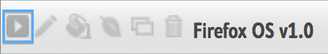
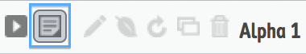
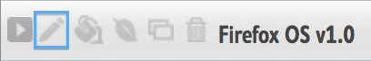
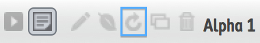
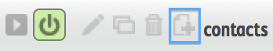

.. _lists:

Working with Lists
==================

Much of the navigation in MozTrap is done with lists. When managing
things like :ref:`Test Cases<test-cases>`, it is possible to have a very long
list of items.

.. _filters:

Filters
-------

You can use filters to narrow down the size of the list you're currently
viewing. You can do simple filtering by either clicking certain fields in the
list (like tags or Product Version), or by typing them in the filter field.

Another option is to click the "Advanced Filtering" button to show your filter
options.  Simply click the item value you would like to use for filtering.  When it
has a check mark next to it, the filter is enabled.

.. Note::

    If you have two filters for items of the same type (such as two Tag
    filters) then the filters are treated as an OR between them, rather than an
    AND. For instance, if you filter on tags "One" and "Two" the list will
    reflect items that have EITHER "One" or "Two", not just ones that have
    both.

Controls
--------

.. _details:

Details
~~~~~~~

Notice there is a triangle on the very left of every list item. Click this
triangle to expand and see details about that list item.

.. _status:

Status
~~~~~~

Many lists have items that can be in ``active``, ``draft``, or ``disabled``
state.  Clicking this icon will give you a drop-down to change the items
state.

* **active** - This item can be used for running tests.  For example, ``active``
  cases and suites will be included in test run execution.  Active runs can be
  executed.
* **draft** - These items are considered *still under development* and won't
  be used in runs.  ``draft`` cases can still be included in suites, and
  ``draft`` suites can still be included in runs, but they will not show up
  when actually executing a run.
* **disabled** - These are items that are no longer intended for use.  Similar
  to draft mode in that they can't be used for test execution.

.. _edit:

Edit
~~~~

Navigates to an edit page where you can change the values of the item.  For
some items, the status may make a difference.  For instance, when editing an
active :ref:`test run<test-runs>`, you will not be able to change which
suites it contains.  You must change it to draft mode first.

.. _environment:

Environment
~~~~~~~~~~~

Navigates to a page to manage which environments pertain to this item.

.. _clone:

Clone
~~~~~

Make a copy of the item.  For :ref:`cases<test-cases>` this is a good way to
make a derivative version of an existing case.

.. _delete:

Delete
~~~~~~

Delete the item.  MozTrap always uses **soft deletes**.  So if you delete
something and change your mind, an administrator can un-delete the item in
the ``/admin`` panel.

Test Run Controls
-----------------

.. _refresh:

Refresh Cases
~~~~~~~~~~~~~

Refreshes the test run cases to remove or add cases based on any
changes in status made to suites or cases (including additions of new
cases to suites) since this run was made active.

See :ref:`Refreshing a Run<test-run-refresh>` for details.

Test Suite Controls
-------------------

.. _add_case:

Add Case
~~~~~~~~

Navigates to the ``Create a new Test Case`` page with this suite
field pre-populated.

See :ref:`Test Cases<test-cases>` for more details.
